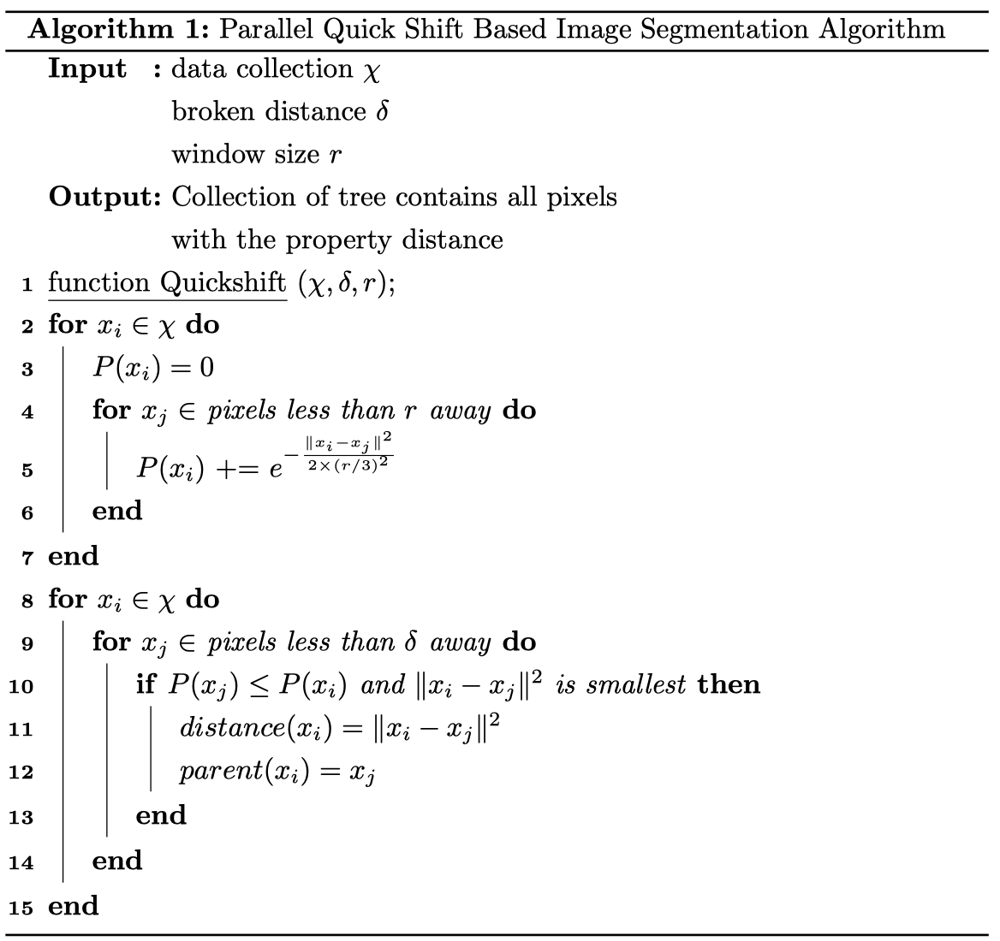
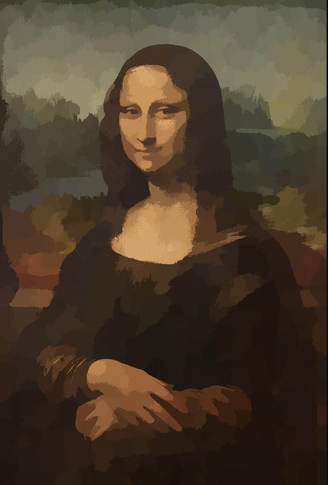
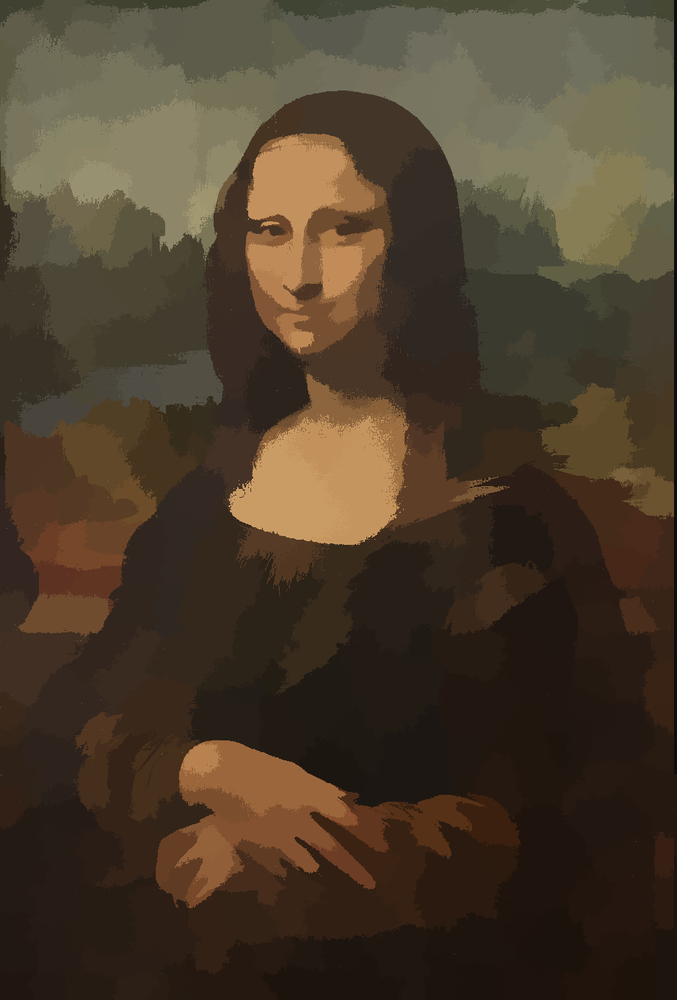

## Parallel Image Segmentation
This repo implements the **quick shift** method to segment images on GPU. Memory access is the critical issue due to the size of image, variants of method are evaluated, yield to the conclusion that texture fetching is the most suitable solution. Compared with serial algorithm, this program performs a 130 to 300 times speed up, promises a real time super pixel computation on modest size.

### Quickshift Algorithm

### Evaluations
Refer to *Report.pdf* for more detailed numeric evaluation. Here are intuitive image outcomes,

> The Image Processing Girl, Lena

> The Mystery, Monalisa

